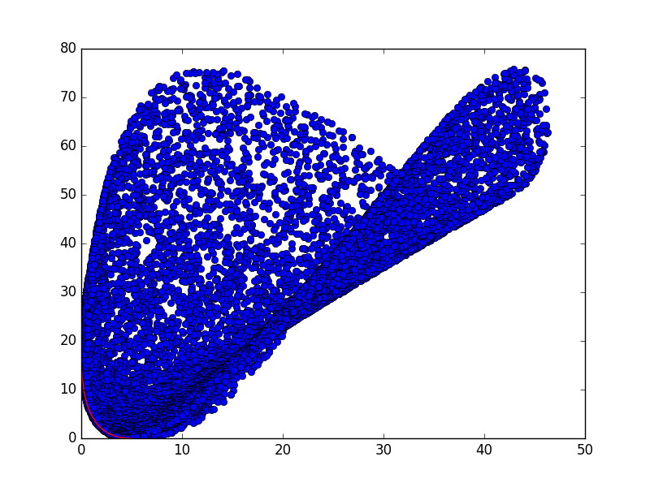

#Pareto 

###Space of estimates and trade-off curve

### Decision set D and P

|        X1        |        X2        |       F1      |          F2          |
|------------------|------------------|---------------|----------------------|
| 0.00238374035882 |  17.4864502554   | 1.95799579958 |  2.0248874969793373  |
| 0.0048520233709  |  16.5182920854   | 2.06600660066 |  1.9777479879515374  |
| 0.0107219293037  |  16.3614138449   |  2.099609961  |  1.9717195301657355  |
| 0.0123365134218  |  15.3670814044   | 1.97479747975 |  1.8918272382031391  |
| 0.0155302831745  |  15.2860088145   | 2.07320732073 |  1.899148766166638   |
| 0.0327209468677  |  14.7509445267   | 1.91239123912 |  1.8417418188988934  |
| 0.0361745178859  |  14.4966566424   | 1.92319231923 |  1.8260025917982636  |
| 0.0375226689677  |  14.2629594213   |  2.099609961  |  1.8338659437740255  |
| 0.0389496661472  |  13.9782383159   | 2.01320132013 |  1.8030853197602204  |
| 0.0516607765339  |  13.7229711935   | 1.95559555956 |  1.7770896543388872  |
| 0.0656856225893  |  13.4742451097   | 2.13801380138 |  1.7840421031359597  |
|  0.097361856265  |  12.3969895931   |      2.0      |  1.6879713855028076  |
|  0.112150224043  |  12.3564018611   | 2.16201620162 |  1.706911319809346   |
|  0.131224038266  |  11.9616048583   |  1.9303930393 |  1.644501885674413   |
|  0.144843459075  |  11.4398941003   | 2.03840384038 |  1.6213595318525345  |
|  0.155380508385  |  11.2950045269   | 2.01080108011 |  1.6059646652220954  |
|  0.184086131925  |  11.1909790285   | 2.20882088209 |   1.62519342171037   |
|  0.185226862111  |  11.0651441403   | 1.93159315932 |  1.5750913436288778  |
|  0.188781131079  |  10.9967932256   | 2.18601860186 |  1.6073446666077835  |
|  0.197320195613  |  10.6621119386   | 2.01080108011 |  1.5559239566453993  |
|  0.218197564779  |  10.4601050657   | 2.16201620162 |  1.5618809349147504  |
|  0.235056082511  |  10.2294378268   |  1.9795979598 |  1.5156036341320336  |
|  0.240410938401  |  10.0468988132   | 2.05520552055 |  1.5128005655778232  |
|  0.254794865593  |   10.042225179   |  1.9603960396 |  1.4967839510563943  |
|  0.287546827766  |  9.49111973615   | 2.06480648065 |  1.4676965641363893  |
|  0.301251781196  |  9.35689651938   | 2.12481248125 |  1.4655155514698155  |
|  0.307115873704  |  9.27548243631   | 2.09360936094 |  1.453782862545375   |
|  0.350545927858  |  9.25365717865   | 1.89558955896 |  1.4172098253580963  |
|  0.356222563025  |  8.92403364615   | 2.20642064206 |  1.4399883201617403  |
|  0.360647569297  |  8.75123254365   |  2.0600060006 |  1.4024660267490123  |
|  0.361624899389  |  8.72864005888   | 2.09360936094 |  1.405977957535253   |
|  0.393312560426  |  8.43943933425   | 2.11521152115 |  1.3835270761666196  |
|  0.39759005399   |  8.41029557131   | 2.06840684068 |  1.3731742202675532  |
|  0.434572244218  |  8.13060055106   | 2.03600360036 |  1.341762972038972   |
|  0.459383837686  |   8.1163718997   | 2.26522652265 |  1.376270307450941   |
|  0.464615673786  |  7.85760419332   | 2.06720672067 |  1.3216940730892155  |
|  0.46981010207   |  7.80102384939   | 2.13081308131 |  1.3271716119033208  |
|  0.496750548382  |  7.63931570652   | 2.04320432043 |  1.2965201246107707  |
|  0.523509824634  |  7.43998766346   | 2.04800480048 |  1.278054459280404   |
|  0.546778869336  |  7.24035608105   | 2.08880888089 |  1.2659074635909322  |
|  0.580490876002  |  7.00134633368   | 2.14521452145 |  1.2520671027685815  |
|  0.58939973019   |   6.9482707473   | 2.10081008101 |  1.2389237503656458  |
|  0.597670222678  |  6.88770178224   | 2.12121212121 |  1.2364701418089323  |
|  0.636810929517  |  6.63849504301   | 2.13561356136 |  1.2136032226076123  |
|  0.653363548734  |  6.53846030215   | 2.12841284128 |  1.201956335200089   |
|  0.675162206838  |  6.41678725901   | 2.10801080108 |  1.1854474395792467  |
|  0.678438952245  |  6.39012431022   | 2.12721272127 |  1.1862089483217773  |
|  0.700751503075  |  6.32888251118   | 2.24722472247 |  1.2002303833768826  |
|  0.717275545338  |   6.2165286653   | 2.23642364236 |  1.1867476365425071  |
|  0.74817355412   |  6.06236553063   | 2.25442544254 |  1.1732949447923575  |
|  0.754063613676  |  5.99721251037   | 2.08520852085 |  1.1358222858404847  |
|  0.790245074871  |   5.7810787046   | 2.12721272127 |  1.1201920673136136  |
|  0.858589769361  |  5.43907438387   | 2.14281428143 |  1.0844707266389584  |
|  0.89452341291   |  5.33761393494   | 2.28682868287 |  1.0987493580616965  |
|  0.921541462681  |  5.31717562125   | 2.00480048005 |  1.0400424915277968  |
|  0.963289008423  |  5.06312550859   | 2.32163216322 |  1.072723471661134   |
|  0.966374335947  |  4.94551992236   |  2.1800180018 |  1.0335798765677788  |
|  1.02879455738   |  4.86581573597   | 2.37563756376 |  1.0578264607414116  |
|  1.04606709847   |  4.65842044542   | 2.28922892289 |  1.0189731254269834  |
|  1.08817813626   |  4.46678209216   | 2.15241524152 |  0.9680369529830521  |
|  1.14373908363   |  4.24469373672   | 2.22442244224 |  0.9543549115267549  |
|  1.15103311082   |  4.21827601666   | 2.20762076208 |  0.947419015004356   |
|  1.18693495493   |  4.09088392269   |  2.2100210021 |  0.9309695356953727  |
|  1.20400589686   |  4.05513789279   | 2.29522952295 |  0.9431909228088884  |
|  1.22484944499   |   4.0388154909   | 2.09600960096 |  0.8974431527050362  |
|  1.31875249578   |  3.94615361325   | 1.97839783978 |  0.8518337043534139  |
|   1.3310163961   |  3.63384437836   | 2.30723072307 |  0.8879632744803132  |
|  1.40132661196   |  3.41185772631   | 2.29642964296 |  0.8539388852564818  |
|  1.42312440992   |   3.3423431794   | 2.27362736274 |  0.8388572541317973  |
|  1.43338538757   |  3.33766982386   | 2.33723372337 |  0.8512359670546168  |
|  1.44124310671   |  3.29689668504   |  2.2196219622 |  0.8197418500893283  |
|  1.48893956325   |   3.2347978461   | 2.40324032403 |  0.8483330323704878  |
|  1.50967387829   |  3.23148381827   | 2.08760876088 |  0.7744394819873781  |
|  1.52611268075   |  3.07720394304   | 2.20402040204 |  0.7816041873407551  |
|  1.53336984364   |  3.04134793854   |  2.2496249625 |  0.7871285221670092  |
|  1.58974203335   |  2.90223552846   | 2.23762376238 |  0.7617443798228027  |
|  1.62428080378   |  2.80843015319   | 2.28202820282 |  0.7571239415782607  |
|  1.64490600651   |  2.76218415517   |  2.2604260426 |  0.7441798365844425  |
|  1.66950277061   |  2.71060901351   | 2.35163516352 |  0.7566756326720503  |
|  1.67446133296   |  2.69625649716   | 2.34563456346 |  0.753004377911564   |
|  1.72636498674   |  2.69334616017   | 2.48604860486 |  0.7792945726106248  |
|  1.73181798335   |  2.66602130114   | 2.47644764476 |  0.7732907332415868  |
|  1.74486434264   |   2.5772990912   | 2.18841884188 |  0.6925740240199367  |
|  1.77270861096   |  2.47046067945   | 2.27482748275 |  0.6972419773070762  |
|  1.78083172157   |   2.453382725    | 2.35643564356 |  0.7140041393658807  |
|  1.83130267116   |  2.39558695112   | 2.44764476448 |  0.7229264563069497  |
|  1.87712310196   |  2.25027726658   | 2.36723672367 |  0.6800529212333988  |
|  1.90248242173   |  2.20203209912   |  2.3804380438 |  0.6741986134579214  |
|  1.95507130465   |  2.09816252629   | 2.30483048305 |  0.6353939464996667  |
|   2.0607989268   |   2.0023206587   | 2.17641764176 |  0.5753331117503278  |
|  2.11029678494   |  1.84307780237   | 2.27242724272 |  0.5730871847370418  |
|  2.17733044949   |   1.7455392664   | 2.26162616262 |  0.5478009087856464  |
|  2.19057606671   |  1.74194593427   |  2.2400240024 |  0.5395327648393993  |
|  2.24890362993   |  1.72467272855   | 2.17401740174 |  0.5104961987905439  |
|  2.25310691209   |   1.6305519574   | 2.26762676268 |  0.5230156304186764  |
|  2.27244846897   |  1.55943142525   |  2.3600360036 |  0.5361617080134877  |
|  2.32718188707   |  1.49283555079   | 2.32763276328 |  0.5100877007372251  |
|  2.35366715382   |  1.48595592292   | 2.54245424542 |  0.5649353514761959  |
|   2.450518561    |  1.43670901427   | 2.64086408641 |  0.5717802046763634  |
|  2.46742695357   |  1.33922615696   | 2.57485748575 |  0.5381635438084373  |
|  2.48745002819   |  1.26108044234   | 2.39603960396 | 0.47336885257497574  |
|  2.58204266434   |  1.14257683608   | 2.49084908491 | 0.46993142631189677  |
|   2.6028769798   |  1.11498435748   |  2.4704470447 | 0.45677073708204485  |
|  2.63240244742   |  1.08057448713   | 2.47284728473 | 0.44796330818328123  |
|  2.69415004296   |  1.01789490497   | 2.42604260426 |  0.414869802723409   |
|  2.74204997921   |  0.991815804066  | 2.59645964596 |  0.4552392191835244  |
|  2.80212387775   |  0.906090673875  |  2.4404440444 |  0.3850285075264823  |
|  2.80373923037   |  0.896432091683  | 2.49084908491 | 0.39912323828132124  |
|  2.94801954348   |  0.79187061276   | 2.40804080408 |  0.3322103712731881  |
|  2.97207720321   |  0.773614332849  | 2.40684068407 | 0.32472155717345075  |
|  3.08251157021   |  0.723871961836  | 2.36363636364 | 0.28236203894574796  |
|  3.08561647888   |  0.676945530962  | 2.67326732673 |  0.377555059289846   |
|  3.10415187698   |  0.637366046698  | 2.49444944494 |   0.30894363684199   |
|  3.26593274173   |  0.538309629573  | 2.70447044704 |  0.3357722118130848  |
|  3.29927477197   |  0.529451904419  | 2.73447344734 |  0.3387283403608201  |
|  3.35794539841   |  0.504242359278  | 2.76567656766 |  0.3351622324832837  |
|  3.40840112318   |   0.4222628232   | 2.57365736574 | 0.24520133635926378  |
|  3.52000093884   |  0.371871880985  | 2.55205520552 | 0.20689208665622072  |
|  3.64346884467   |  0.318939562531  | 2.55445544554 |  0.1735148498879191  |
|  3.66981920129   |  0.280309375388  | 2.71887188719 | 0.22431916969763233  |
|  3.71144844065   |  0.271005688021  | 2.61086108611 | 0.17289924357574904  |
|  3.74262196446   |  0.249833021792  | 2.74767476748 | 0.21573421079170796  |
|  3.79802665335   |  0.226968188306  | 2.65646564656 | 0.16503964396123294  |
|  3.87898268739   |  0.194626192669  | 2.77767776778 | 0.19052494438287582  |
|  3.96554589703   |  0.160255956441  | 2.77407740774 |  0.1652384177091477  |
|  4.09012949121   |  0.125836660346  | 2.72487248725 | 0.11196150239413694  |
|  4.22983775947   |  0.118635408922  | 2.93729372937 | 0.16933940219686416  |
|  4.26863887728   |  0.110686207934  | 2.94809480948 |  0.1643107263168595  |
|  4.37129218144   | 0.0647332769102  | 2.77287728773 | 0.05733356451666172  |
|  4.46564961606   | 0.0485851740158  | 2.79687968797 | 0.042799862313358084 |
|   4.6859689358   | 0.0267848475522  | 2.83648364836 | 0.003436942688065159 |
|  4.81099650199   | 0.00820479269019 | 2.99489948995 | 0.045218296870332075 |
|  5.00223433158   | 0.00463425740479 | 2.95169516952 | -0.02398385267630765 |
